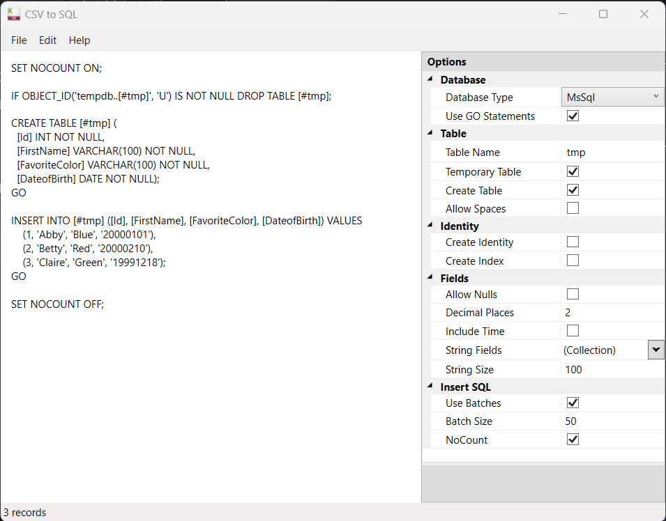

# Elars.CsvToSql
Elars.CsvToSql is a collection of .NET libraries and tools to convert CSV or tab-delimited files to SQL insert statements.

### [Elars.CsvToSql.Core](../../tree/main/Elars.CsvToSql.Core)
A library to convert CSV and tab-delimited files to SQL insert statements.

| Id | First Name | Favorite Color | Date of Birth |
|----|------------|-----------------|---------------:|
| 1  | Abby       | Blue            | 1/1/2000      |
| 2  | Betty      | Red             | 2/10/2000     |
| 3  | Claire     | Green           | 12/18/1999    |

```sql
SET NOCOUNT ON;

IF OBJECT_ID('tempdb..[#tmp]', 'U') IS NOT NULL DROP TABLE [#tmp];

CREATE TABLE [#tmp] (
  [Id] INT NOT NULL, 
  [FirstName] VARCHAR(100) NOT NULL, 
  [FavoriteColor] VARCHAR(100) NOT NULL, 
  [DateofBirth] DATE NOT NULL);
GO

INSERT INTO [#tmp] ([Id], [FirstName], [FavoriteColor], [DateofBirth]) VALUES 
    (1, 'Abby', 'Blue', '20000101'),
    (2, 'Betty', 'Red', '20000210'),
    (3, 'Claire', 'Green', '19991218');
GO

SET NOCOUNT OFF;
```

### [Elars.CsvToSql.UI](../../tree/main/Elars.CsvToSql.UI)
Sample WPF app implementing Elars.CsvToSql.Core



### Alternatives/Inspiration
There are some great tools out there to do this. With sensitive data though, I'm reluctant to put the data on a third-party site.

|Tool|Type|
|----|----|
|[CSV to SQL Convert](https://www.convertcsv.com/csv-to-sql.htm)|Website|
|[csvkit csvsql](https://github.com/wireservice/csvkit)|Command line|
|[Konbert Convert CSV to SQL](https://konbert.com/convert/csv/to/sql)|Website|
|[Manage Engine CSV to SQL Converter](https://www.site24x7.com/tools/csv-to-sql.html)|Website|
